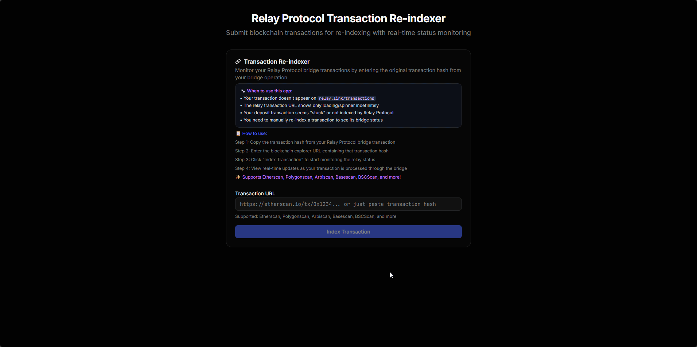

# Relay Protocol Indexer App

A React-based application for indexing and monitoring relay protocol transactions, created with GitHub Spark.



## 🌐 Live Demo

🚀 **[View Live Application](https://warengonzaga.github.io/relay-protocol-indexer-app/)**

The application is automatically deployed to GitHub Pages on every push to the main branch.

## 🚀 Features

- Real-time transaction monitoring
- Protocol indexing and analysis
- Interactive dashboard interface
- Built with modern React and TypeScript
- Created using GitHub Spark

## 🛠️ Tech Stack

- **Frontend**: React 19, TypeScript
- **Styling**: Tailwind CSS, Radix UI components
- **Build Tool**: Vite
- **Package Manager**: pnpm
- **Icons**: Phosphor Icons, Heroicons
- **Deployment**: GitHub Pages with GitHub Actions

## 📋 Prerequisites

- Node.js (version 16 or higher)
- pnpm (install with `npm install -g pnpm`)

## 🚀 Getting Started

### Installation

```bash
# Clone the repository
git clone https://github.com/warengonzaga/relay-protocol-indexer-app.git
cd relay-protocol-indexer-app

# Install dependencies
pnpm install

# Start development server
pnpm dev
```

### Available Scripts

```bash
# Development server
pnpm dev

# Build for production
pnpm build

# Preview production build
pnpm preview

# Lint code
pnpm lint

# Optimize dependencies
pnpm optimize
```

## 🌐 Development

The development server will start at `http://localhost:5000/` by default.

## ⚡ About GitHub Spark

This application was created using [GitHub Spark](https://github.com/features/spark), a GitHub feature that enables you to build micro web apps with natural language. Key features include:

- **Natural Language Development**: Build apps by describing what you want in plain English
- **Instant Deployment**: Automatically deployed and shareable micro web apps
- **Modern Web Stack**: Built with React, TypeScript, and modern tooling
- **GitHub Integration**: Seamlessly integrated with GitHub's development ecosystem

## 📦 Build

To create a production build:

```bash
pnpm build
```

For GitHub Pages deployment:

```bash
pnpm build:gh-pages
```

The built files will be generated in the `dist` directory.

## 🚀 Deployment

### Automatic Deployment

This project is configured for automatic deployment to GitHub Pages using GitHub Actions. Every push to the `main` branch will trigger a new deployment.

### Manual Deployment

To deploy manually:

1. Make sure GitHub Pages is enabled in your repository settings
2. Set the source to "GitHub Actions" in Pages settings
3. Push to the main branch or run the workflow manually

### Local Preview

To preview the production build locally:

```bash
pnpm preview
```

```bash
pnpm build
```

The built files will be generated in the `dist` directory.

## 🤝 Contributing

1. Fork the repository
2. Create your feature branch (`git checkout -b feature/amazing-feature`)
3. Commit your changes (`git commit -m 'Add some amazing feature'`)
4. Push to the branch (`git push origin feature/amazing-feature`)
5. Open a Pull Request

## 📄 License

This project is licensed under the MIT License - see the [LICENSE](LICENSE) file for details.